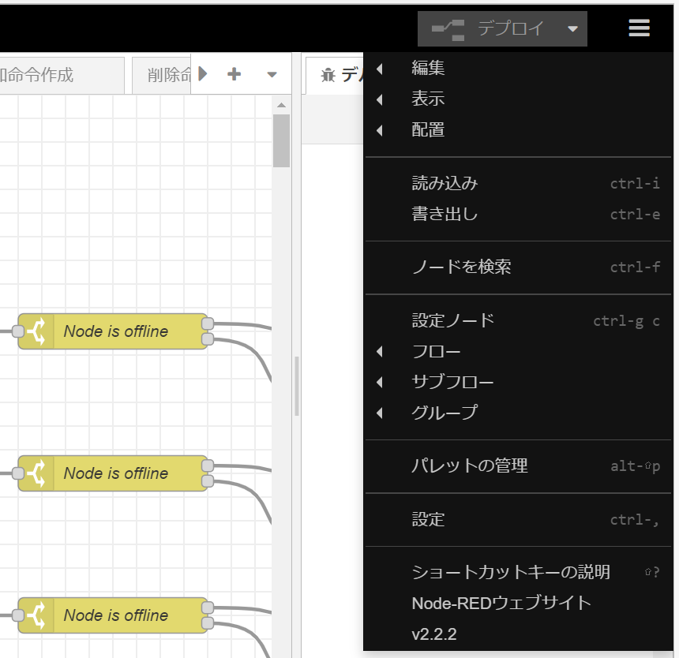

# Node-REDの導入方法

## インストールについて

- 以下のURLの手順に従い、Node-REDをインストールする。

    - [ローカルでNode-REDを実行する : Node-RED日本ユーザ会](https://nodered.jp/docs/getting-started/local)

- インストールできたら、ターミナルにおいて `node-red` コマンドを使ってNode-REDを起動できます。
  Ctrl-Cを使うか、ターミナルウィンドウを閉じることでNode-REDを停止できます。

## ノードの追加方法について

### メインメニューを開く

- Node-REDを起動したら、`http://localhost:1800`を指定することで、Node-REDエディタにアクセスできます。

  

- エディタ右上にある三本線のアイコンをクリックしてメインメニューを開き、
  `パレットを管理する`オプションを選択してパレットマネージャを開くことで、
  エディタ内で直接ノードをインストールすることができます。

### パレットマネージャからノードを追加する

- `ノードを追加`タブを開き、検索等を用いて以下の3つのノードを追加してください。

    - node-red-contrib-azure-table-storage-aleph
    - node-red-contrib-calc
    - node-red-contrib-wio-seeed

## フローの適用方法

- 上記の方法でメインメニューを開き、`読み込み`オプションを選択してメニューを開き、`クリップボード`ボタンをクリックします。

- `読み込むファイルを選択`より、githubリポジトリのあるフォルダ下のNode-RED/flows.jsonを選択し、Jsonファイルを読み込みます。

- それぞれのノードに必要な設定項目を記入します。

  - `センサー取得`フロー下にある、wio-sensorノードの`Connection`プロパティにアカウント情報を追加してください。
    Tokenの取得方法は以下のURLを参照。

    - [Wio Nodeのノードで認証がうまく行かなくてManual TokenしたTIPS](https://qiita.com/tseigo/items/b45daca828bacb5adb28)

  - また、wio-sensorノードに取得するセンサーの情報を設定する。

    - co2ではUART0 - Grove CO2 MH-Z16のCO2 ConcentrationのRaw Objectを取得

    - tempではUART0 - Grove CO2 MH-Z16のCelsius TemperatureのRaw Objectを取得
      （※Unity側では使っていないデバッグ用項目）

    - gsr（電気皮膚反応測定センサ）ではA0-Generic Analog InputのAnalogのRaw Objectを取得

    - ud（超音波距離測定センサ）ではD0 - Generic Digital OutputのOn/Off StatusのRaw Objectを取得

  - `削除命令作成`、`ログのみデータベース操作`、`検索`フロー下にある、
    AzureTableノードにAzureStorageアカウントの設定項目を記入してください。

- エディタ右上の`デプロイ`ボタンを押すことで、変更が保存されフローが実行されます。

  - Unity側から処理を呼び出す場合、`センサー取得`フロー下にある
    `Get and Insert ～`ノードを有効化することで、定期的にセンサー情報を更新できます。
